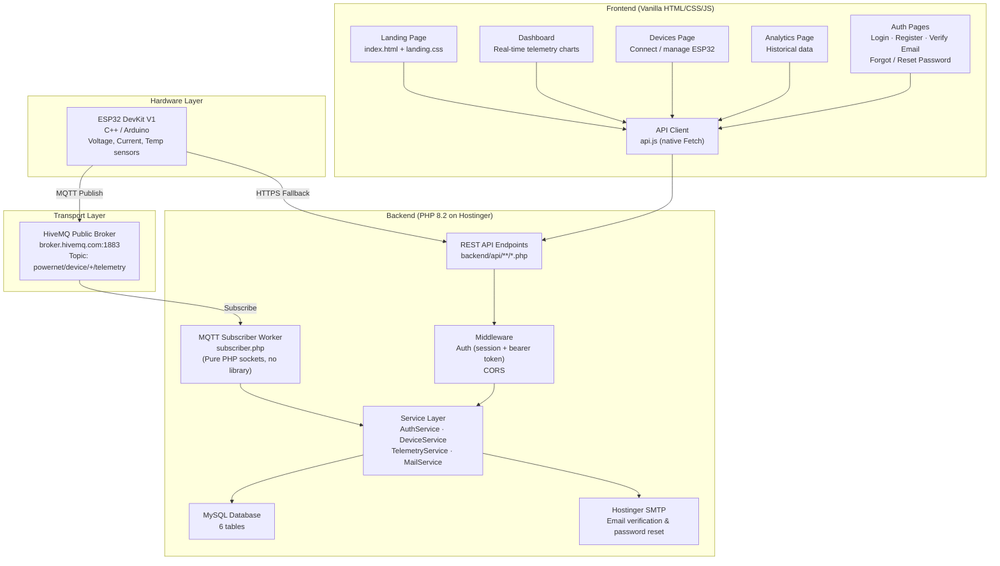

# PowerNet — Full Codebase Architecture

## What Is It?

**PowerNet** is an IoT smart electrical energy monitoring & AI load prediction platform. An ESP32 microcontroller reads voltage, current, and temperature sensors, publishes telemetry via MQTT to a cloud backend, and a web dashboard displays it all in real time.

**Live domain:** `https://powernet.ashiik.com`

---

## Programming Languages

| Layer | Language | Runtime / Platform |
|---|---|---|
| Frontend | **HTML + CSS + Vanilla JavaScript** | Browser |
| Backend API | **PHP 8.2** | Hostinger shared hosting (PHP-FPM) |
| Database | **SQL** (MySQL/MariaDB) | Hostinger MySQL |
| Firmware | **C++ (Arduino)** | ESP32 DevKit V1 |
| Infra config | Nginx conf, `.htaccess` | Hostinger / Nginx |

---

## Architecture Diagram



---

## Frontend Architecture

**Stack:** Pure HTML5 + Vanilla CSS + Vanilla JavaScript (zero frameworks, zero build step)

### Pages ([frontend/](file:///c:/Users/DIU/Desktop/powernet/frontend))

| Clean URL | File | Purpose |
|---|---|---|
| `/` | [index.html](file:///c:/Users/DIU/Desktop/powernet/frontend/index.html) | Landing page (marketing, hero, FAQ) |
| `/dashboard` | [dashboard.html](file:///c:/Users/DIU/Desktop/powernet/frontend/dashboard.html) | Real-time telemetry dashboard |
| `/devices` | [devices.html](file:///c:/Users/DIU/Desktop/powernet/frontend/devices.html) | Device management (connect/disconnect ESP32) |
| `/analytics` | [analytics.html](file:///c:/Users/DIU/Desktop/powernet/frontend/analytics.html) | Historical analytics |
| `/login` | [login.html](file:///c:/Users/DIU/Desktop/powernet/frontend/login.html) | Login |
| `/register` | [register.html](file:///c:/Users/DIU/Desktop/powernet/frontend/register.html) | Registration |
| `/verify-email` | [verify-email.html](file:///c:/Users/DIU/Desktop/powernet/frontend/verify-email.html) | Email verification |
| `/forgot-password` | [forgot-password.html](file:///c:/Users/DIU/Desktop/powernet/frontend/forgot-password.html) | Forgot password |
| `/reset-password` | [reset-password.html](file:///c:/Users/DIU/Desktop/powernet/frontend/reset-password.html) | Reset password |

### JavaScript Modules ([assets/js/](file:///c:/Users/DIU/Desktop/powernet/assets/js))

| File | Role |
|---|---|
| [api.js](file:///c:/Users/DIU/Desktop/powernet/assets/js/api.js) (41 KB) | Central API client — native `fetch`, token management (`localStorage`), all endpoint wrappers |
| [dashboard.js](file:///c:/Users/DIU/Desktop/powernet/assets/js/dashboard.js) (55 KB) | Dashboard logic — real-time charts, telemetry polling, event logs |
| [devices.js](file:///c:/Users/DIU/Desktop/powernet/assets/js/devices.js) | Device connect/disconnect, device card rendering |
| [auth.js](file:///c:/Users/DIU/Desktop/powernet/assets/js/auth.js) | Login, register, email verify, password reset form handlers |
| [analytics.js](file:///c:/Users/DIU/Desktop/powernet/assets/js/analytics.js) | Analytics page logic |

### Stylesheets ([assets/css/](file:///c:/Users/DIU/Desktop/powernet/assets/css))

| File | Purpose |
|---|---|
| [style.css](file:///c:/Users/DIU/Desktop/powernet/assets/css/style.css) (31 KB) | Global styles, design system |
| [landing.css](file:///c:/Users/DIU/Desktop/powernet/assets/css/landing.css) (33 KB) | Landing page specific |
| [dashboard.css](file:///c:/Users/DIU/Desktop/powernet/assets/css/dashboard.css) (20 KB) | Dashboard specific |
| [auth.css](file:///c:/Users/DIU/Desktop/powernet/assets/css/auth.css) | Auth pages (login, register, etc.) |
| [responsive.css](file:///c:/Users/DIU/Desktop/powernet/assets/css/responsive.css) (15 KB) | Mobile / tablet breakpoints |

### Frontend Key Patterns
- **Auth:** Bearer token stored in `localStorage` (`pnet_token`), user object in `pnet_user`
- **Routing:** Clean URLs (`/dashboard`, `/login`) — no hash or client-side router; Nginx and `.htaccess` rewrite to `frontend/*.html`
- **Fonts:** Google Fonts (Inter)
- **Icons:** FontAwesome 6

---

## Backend Architecture

**Stack:** PHP 8.2 with namespaces, strict types, zero external packages (no Composer, no vendor dependencies)

### Directory Layout

```
backend/
├── api/                         # REST endpoints (one file = one endpoint)
│   ├── auth/                    # 9 endpoints
│   │   ├── login.php
│   │   ├── register.php
│   │   ├── logout.php
│   │   ├── me.php
│   │   ├── profile.php
│   │   ├── verify-email.php
│   │   ├── resend-verification.php
│   │   ├── forgot-password.php
│   │   └── reset-password.php
│   ├── devices/                 # 4 endpoints
│   │   ├── connect.php
│   │   ├── list.php
│   │   ├── remove.php
│   │   └── status.php
│   ├── telemetry/               # 6 endpoints
│   │   ├── push.php             # ESP32 pushes data here
│   │   ├── latest.php
│   │   ├── history.php
│   │   ├── summary.php
│   │   ├── logs.php
│   │   └── clear-logs.php
│   └── predictions/             # 2 endpoints
│       ├── latest.php
│       └── history.php
├── config/
│   └── env.php                  # Custom .env loader (no vlucas/dotenv)
├── database/
│   └── connection.php           # PDO MySQL singleton
├── middleware/
│   ├── auth.php                 # Session + Bearer HMAC token auth
│   └── cors.php                 # CORS headers
├── mqtt/subscriber/
│   ├── subscriber.php           # MQTT ingestion worker (pure PHP sockets)
│   └── simulate_esp32.php       # Simulator for testing
└── services/
    ├── AuthService.php           # Registration, login, email verification, password reset
    ├── DeviceService.php         # Device CRUD, ownership
    ├── TelemetryService.php      # Telemetry storage, queries, aggregations
    └── MailService.php           # Hostinger SMTP email (native PHP sockets)
```

### Backend Key Patterns
- **Auth:** PHP sessions + HMAC-SHA256 bearer tokens (base64-encoded `userId:hmac`)
- **API routing:** File-based — `/api/auth/login` → `backend/api/auth/login.php`
- **Zero dependencies:** Custom `.env` parser, custom MQTT client, custom SMTP client — all pure PHP sockets
- **Namespace:** `PowerNet\Config`, `PowerNet\Services`, `PowerNet\Middleware`, `PowerNet\Database`

---

## Database Schema (MySQL)

**6 tables** defined in [schema.sql](file:///c:/Users/DIU/Desktop/powernet/database/schema.sql):

| Table | Purpose |
|---|---|
| `users` | User accounts (name, email, password_hash, email_verified) |
| `devices` | IoT devices (device_id, user_id, status, last_seen) |
| `telemetry` | Sensor readings (voltage, current, power, energy, temperature) |
| `email_verifications` | Email verification tokens |
| `password_resets` | Password reset tokens |
| `predictions` | AI load predictions (future feature, table ready) |

---

## IoT / Hardware Layer

**Firmware:** [PowerNetESP32.ino](file:///c:/Users/DIU/Desktop/powernet/esp32/PowerNetESP32/PowerNetESP32.ino) — C++ Arduino

- **Board:** ESP32 DevKit V1
- **Sensors:** Voltage (pin 34), Current (pin 35), Temperature (pin 32)
- **Connectivity:** WiFi → MQTT publish to `powernet/device/pnw101/telemetry`
- **Fallback:** HTTPS POST to `powernet.ashiik.com/api/telemetry/push.php` if MQTT fails
- **Libraries:** WiFi, PubSubClient, HTTPClient, ArduinoJson
- **Telemetry interval:** 5 seconds

---

## Data Flow (End to End)

```
ESP32 sensors read → JSON payload → MQTT publish
                                        ↓
                            HiveMQ broker.hivemq.com
                                        ↓
                            PHP MQTT subscriber.php
                                        ↓
                            TelemetryService → MySQL
                                        ↓
                            Frontend polls /api/telemetry/latest
                                        ↓
                            dashboard.js renders charts
```

---

## Deployment

| Component | Where |
|---|---|
| Frontend + Backend PHP | **Hostinger** shared hosting |
| Database | Hostinger MySQL (`u697802579_powernetdb`) |
| MQTT Broker | **HiveMQ** public broker |
| Domain | `powernet.ashiik.com` (Hostinger DNS) |
| SMTP | Hostinger SMTP (`smtp.hostinger.com:465`) |
| SSL | Let's Encrypt (via Hostinger) |
| Web Server | **Nginx** (config in [nginx.conf](file:///c:/Users/DIU/Desktop/powernet/nginx.conf)) + Apache fallback ([.htaccess](file:///c:/Users/DIU/Desktop/powernet/.htaccess)) |

---

## Summary

| Metric | Value |
|---|---|
| **Total languages** | 5 (HTML, CSS, JS, PHP, C++) |
| **Frontend framework** | None (vanilla) |
| **Backend framework** | None (vanilla PHP) |
| **Composer deps** | 0 |
| **Arduino libs** | 4 (WiFi, PubSubClient, HTTPClient, ArduinoJson) |
| **API endpoints** | 21 |
| **DB tables** | 6 |
| **Frontend pages** | 9 |
